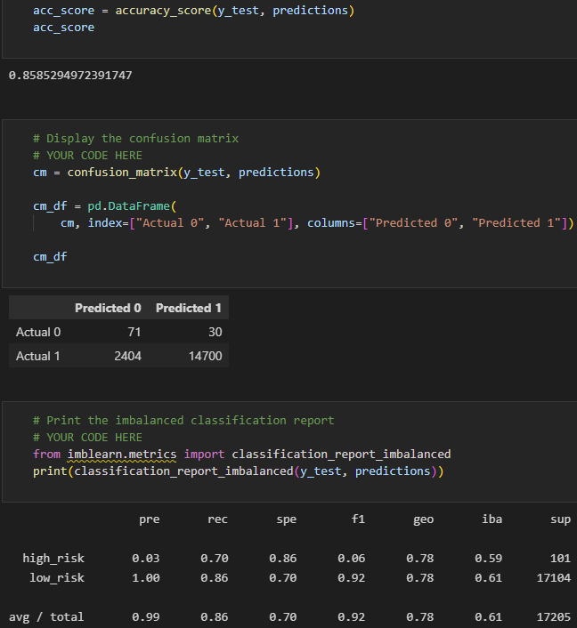
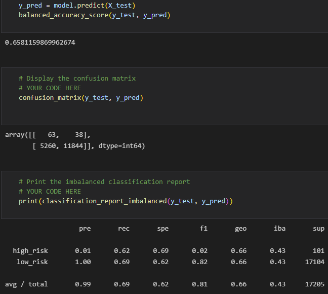
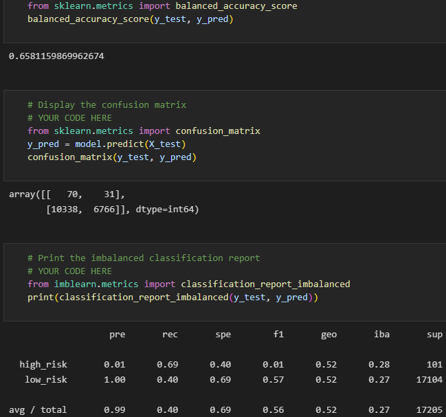
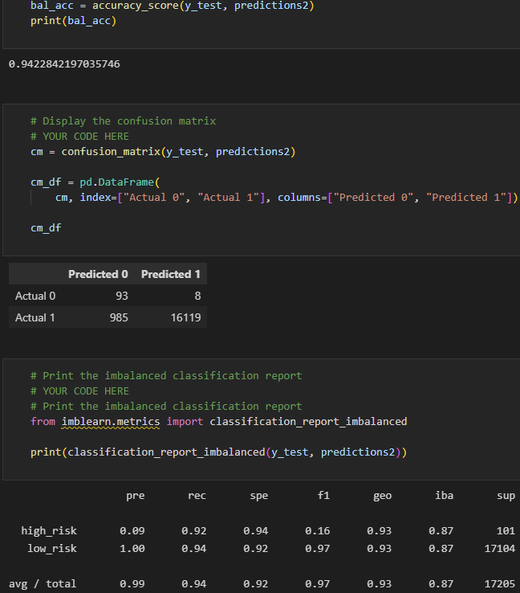

# Credit_risk_Analysis
The purpose of this analysis is to apply machine learning to determine credit risk. Different algorithms are used to evaluate which one best suits the problem of determining credit risk with accuracy.

## Naive Ramdom Oversampling

    * Accuracy - 0.66
    * Precision - high risk = 0.1, Low risk - 1.00
    * Recall - high risk = 0.72, low risk = 0.60

## Smote Oversampling

    * Accuracy - 0.66
    * Precision - high risk = 0.1, Low risk - 1.00
    * Recall - high risk = 0.62, low risk = 0.69

## Undersampling

    * Accuracy - 0.66
    * Precision - high risk = 0.1, Low risk - 1.00
    * Recall - high risk = 0.69, low risk = 0.40

## Combination (Oversampling and Undersampling)

    * Accuracy - 0.54
    * Precision - high risk = 0.1, Low risk - 1.00
    * Recall - high risk = 0.72, low risk = 0.57

## Balanced Random Forrest Classifier

    * Accuracy - 0.86
    * Precision - high risk = 0.03, Low risk - 1.00
    * Recall - high risk = 0.70, low risk = 0.86

## Easy Ensamble Adaboost Classifier

    * Accuracy - 0.94
    * Precision - high risk = 0.09, Low risk - 1.00
    * Recall - high risk = 0.92, low risk = 0.94

## Summary

Naive oversampling, smote sampling and undersampling provide the same accuracy and precision numbers. However the highest recall came from smote oversampling at 0.69. Since recall determins the number of positives that have been correctly identified, this number would need to be higher for there to be more confidence in the model.

The Balanced Random Classifier and Easy Ensemble Classifier offer much higher accuracies with better recall numbers. The Easy Ensamble Classifier seems to be the better algorithm for this dataset.

